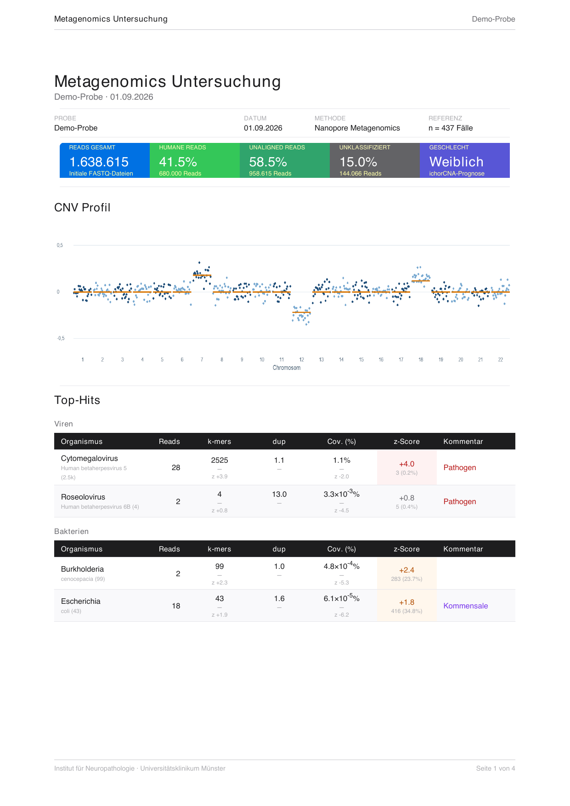

# 🧬 mNGS Pipeline

Automatisierte Metagenom-Analyse für **Oxford Nanopore** und **Illumina
Paired-End**: humane Reads werden gegen hg19 ausgerichtet, ein CNV-Profil wird
erstellt und ausschließlich die nicht ausgerichteten Reads werden mit
KrakenUniq klassifiziert.

```text
📥 FASTQ ──▶ 🧬 hg19-Alignment ──┬──▶ 📈 ichorCNA (CNV)
                                 └──▶ 🧹 unaligned Reads ──▶ 🦠 KrakenUniq
                                                                  │
                                                📄 PDF · JSON · DOCX ◀──┘
```

## ✨ Auf einen Blick

- 🔬 **Nanopore:** Chunk-Dateien werden zusammengeführt und mit `minimap2 -x map-ont` ausgerichtet.
- 🧪 **Illumina:** R1/R2-Paare werden mit `bwa-mem2 mem` ausgerichtet; nur vollständig ungemappte Paare gelangen zu KrakenUniq.
- 📊 **CNV:** ichorCNA analysiert das vollständige hg19-Alignment mit hg19-PoN.
- 🦠 **Metagenomik:** KrakenUniq erhält ausschließlich Host-depletierte Reads.
- ♻️ **Wiederaufnahme:** Fertige Schritte werden erkannt; unterbrochene Jobs laufen an der letzten vollständigen Stufe weiter.
- 🖥️ **SLURM:** Auf PALMA wird pro Probe ein Job eingereicht; lokal läuft die Pipeline seriell.

## 📄 Report

Der PDF-Report zeigt initiale Reads, humane Reads, unaligned Reads,
unklassifizierte Reads und die ichorCNA-Geschlechtsprognose. Darunter folgen
CNV-Profil und priorisierte KrakenUniq-Treffer. Zusätzlich entstehen eine
maschinenlesbare JSON-Zusammenfassung und ein DOCX-Befundentwurf.



<sub>Anonymisierte Darstellung mit integrierten Demo-Werten und synthetischem
CNV-Verlauf – keine identifizierenden Probendaten.</sub>

## 🚀 Schnellstart

```bash
# 1. Umgebungen einmalig einrichten
bash scripts/setup_envs.sh

# 2. FASTQ-Dateien nach input/ kopieren und Pipeline starten
bash run_pipeline.sh
```

Optional:

```bash
bash run_pipeline.sh --mail user@uni-muenster.de  # SLURM-Benachrichtigungen
bash run_pipeline.sh --partition normal           # Partition fest vorgeben
KRAKENUNIQ_ENABLED=false bash run_pipeline.sh      # Testlauf ohne KrakenUniq-DB
```

Referenz-, Datenbank- und Modulpfade stehen zentral in
[`scripts/config.sh`](scripts/config.sh) und können auch als
Umgebungsvariablen überschrieben werden.

## 📥 Eingaben

Alle FASTQ-Dateien liegen direkt in `input/` – ohne Unterordner.

| Plattform | Benennung | Verhalten |
| --- | --- | --- |
| Nanopore | `Probe_barcode01_0.fastq.gz`, `..._1.fastq.gz` | Chunks mit gleichem Stamm werden numerisch sortiert zusammengeführt. |
| Illumina | `Probe_R1_001.fastq.gz` + `Probe_R2_001.fastq.gz` | Passende R1/R2-Dateien werden automatisch als Paar erkannt. |

Plain FASTQ und gzip-komprimierte FASTQ werden unterstützt.

## 📤 Ergebnisse

Pro Probe entstehen unter `output/<Probe>/`:

| Datei | Inhalt |
| --- | --- |
| `<Probe>.metagenomics_report.pdf` | Visueller Gesamtbericht mit Read-Metriken, CNV und Top-Hits |
| `<Probe>.summary.json` | Strukturierte Zusammenfassung für die Weiterverarbeitung |
| `<Probe>_Nexus_Befund.docx` | Editierbarer Befundentwurf |
| `<Probe>.krakenuniq.report.txt` | Vollständiger KrakenUniq-Report |

BAM, Host-depletierte FASTQ und ichorCNA-Zwischenergebnisse bleiben unter
`tmp/<Probe>/` erhalten. Damit lässt sich nur der Report neu erzeugen:

```bash
bash scripts/generate_sample_report.sh <Probe> nanopore   # oder: illumina
```

## ⚙️ Ausführung auf PALMA

Die Pipeline fragt vor dem Einreichen die freien CPUs mit `sinfo` ab und nutzt
ausschließlich die Partitionen **`normal`** und **`requeue`**, auf denen die
benötigten Module verfügbar sind. `requeue` darf Jobs unterbrechen; dank
Schrittprüfung und atomarer KrakenUniq-Ausgabe kann die Verarbeitung sicher
fortgesetzt werden. Fehlen Referenz oder Indizes, werden sie einmalig in einem
vorgeschalteten Job vorbereitet.

Wichtige Vorgaben lassen sich ohne Dateiänderung setzen:

```bash
SLURM_AUTO_PARTITION=false bash run_pipeline.sh
SLURM_CPU_PARTITIONS=normal bash run_pipeline.sh
KRAKENUNIQ_DB=/pfad/zur/db bash run_pipeline.sh
```

## 🧪 Tests

```bash
python3 -m unittest discover -s tests -v
```

> [!IMPORTANT]
> `input/`, `output/`, `tmp/` und `log/` gehören nicht ins Repository. Den
> DOCX-Befundentwurf vor diagnostischer Verwendung immer fachlich prüfen.
